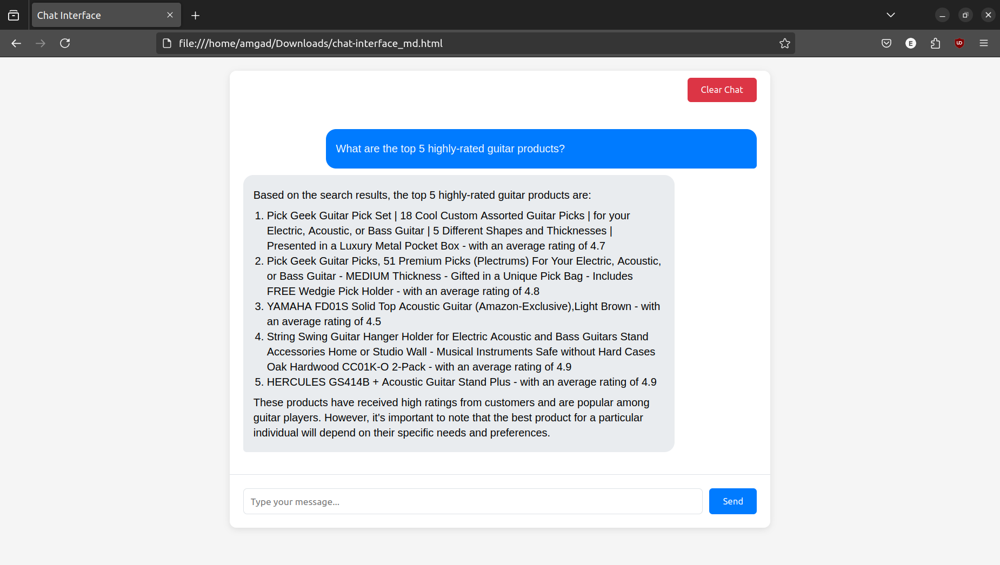
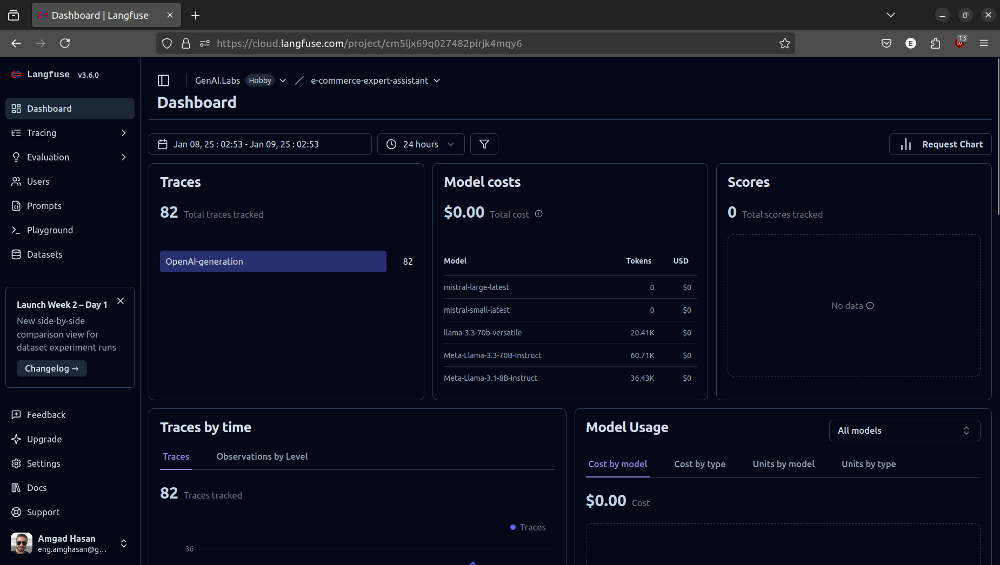
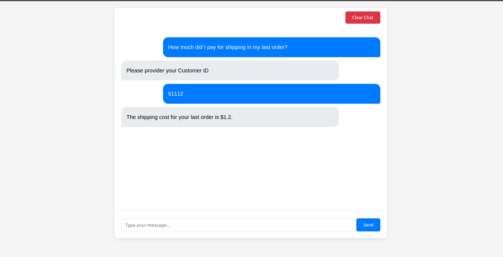
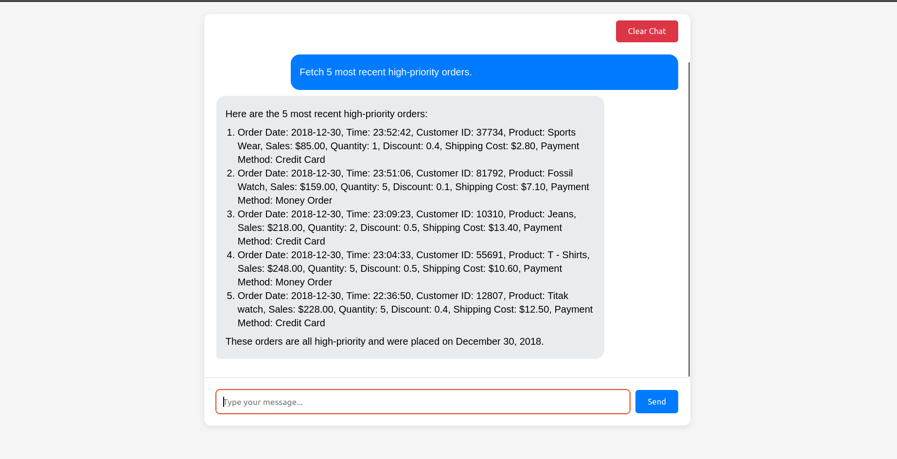
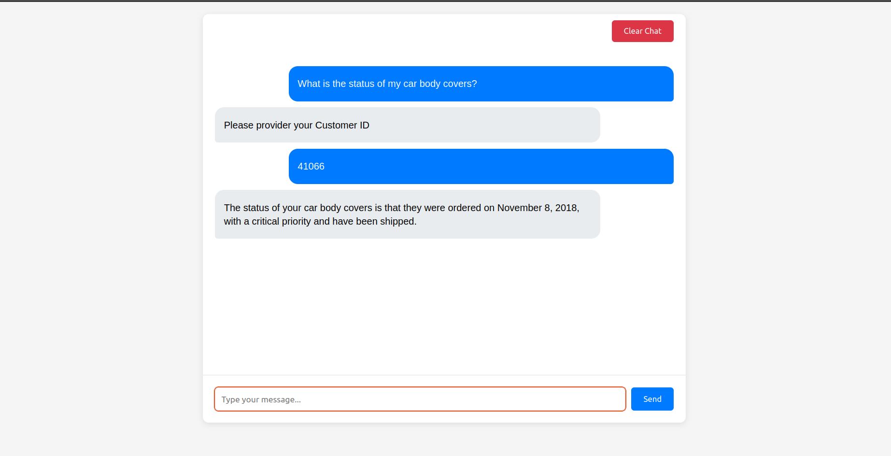
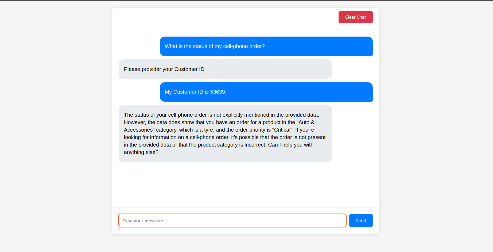
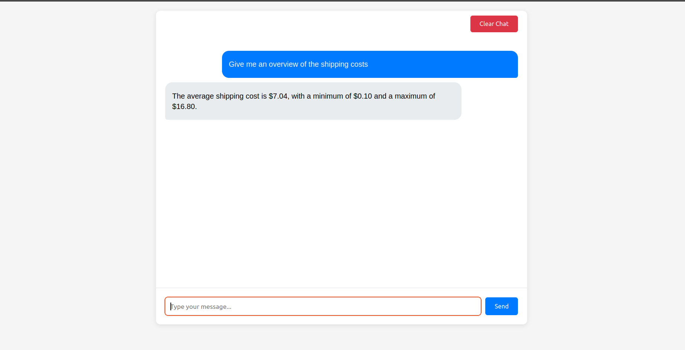
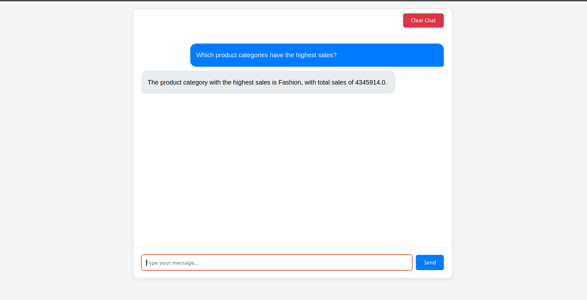
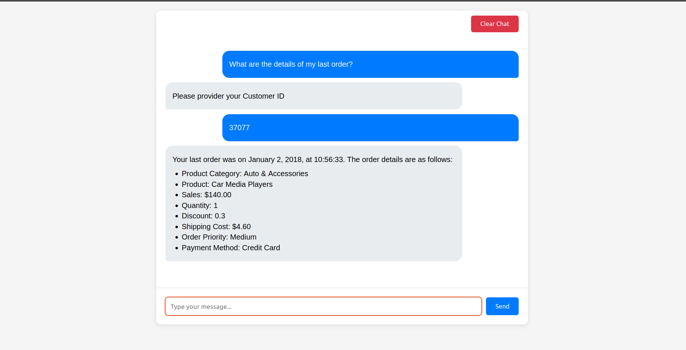

E-Commerce Expert Assistant Chatbot
=====================================

### Overview

This project is a smart e-commerce assistant chatbot that utilizes Retrieval-Augmented Generation (RAG) to provide accurate responses to customer queries about product details and order information. The chatbot integrates with product and order datasets to deliver contextually relevant answers.

### Features

#### Core Functionality

*   Product information retrieval and recommendations
*   Order history and status tracking
*   RAG-enhanced response generation
*   Cost-efficient model implementation
*   Mock API integration for order data

#### Bonus Features

*   Cloud-based hosting interface
*   [Basic UI for testing](#local-ui)
*   Model comparison analysis (closed vs open-source)
*   [LLM Observability and monitoring](#observability)

### Dataset Information

#### Product Dataset

*   5000 rows of musical instrument data
*   Fields include:
    *   Product title
    *   Description
    *   Features
    *   Ratings
    *   Price
    *   Categories

#### Order Dataset

*   Customer order history
*   Fields include:
    *   Order date
    *   Customer ID
    *   Product category
    *   Sales amount
    *   Shipping cost
    *   Payment method

### Technical Implementation

#### Architecture

The core part of the project is implemented as a backend API server that handles user chat. It consists of the following components:

*   LLM for interacting with the user
*   Order Data API
*   Product Data Index
*   Embedding Model for semantic search
*   Vector DB to store, search, and retrieve vector embeddings

#### Requirements

*   Python 3.8+
*   Preferred: UV for dependency management

### Usage

#### Environment Variables

Make sure to set up your `.env` file with the following fields:
```makefile
OPENAI_BASE_URL=
OPENAI_API_KEY=
CHAT_MODEL=
EMBEDDING_URL=
EMBEDDING_API_KEY=
EMBEDDING_MODEL=BAAI/bge-m3
EMBEDDING_BATCH_SIZE=
QDRANT_URL=
QDRANT_API_KEY=
LANGFUSE_SECRET_KEY=
LANGFUSE_PUBLIC_KEY=
LANGFUSE_HOST=https://cloud.langfuse.com
```

#### Docker

The best way to use the published Docker [images](https://github.com/AmgadHasan/e-commerce-expert-assistant/pkgs/container/e-commerce-expert-assistant).

To start the backend API server at [http://0.0.0.0:3000/](http://0.0.0.0:3000/), simply run:
```bash
docker pull ghcr.io/amgadhasan/e-commerce-expert-assistant:main
docker run -d --env-file.env -p 3000:8000 ghcr.io/amgadhasan/e-commerce-expert-assistant:main
```

#### Local UI

To chat with the LLM using a GUI locally, run the `ui.html` file in a browser.



Make sure to modify the API URL before running it:
```javascript
const API_URL = 'http://20.121.120.6:3000/chat'
```

### Development

1. Clone the repository:
```bash
git clone https://github.com/AmgadHasan/e-commerce-expert-assistant.git
```
2. Create and activate a virtual environment:
```bash
# Using uv
uv sync
```

### Project Structure

```
e-commerce-expert-assistant/
├── data/
│   ├── order_data.parquet
│   └── product_information.parquet
├── src/
├── scripts/
├── Dockerfile
├── Time Estimates.csv
└── README.md
```

### Model Selection and Trade-offs

We experimented with the following models:

#### Groq Gemma2-9B-IT

*   Very fast but had a limited context window of 8k tokens.
*   Erred out frequently when doing RAG as the retrieved context is usually 4k+ tokens.
*   Made mistakes when doing tool calling, such as calling `get_user_data` and passing `"customer_id": "customer_id"` which is an invalid argument.

#### Sambanova Meta-Llama/Llama-3.3-70B-Instruct

*   Very good at understanding user queries and making decisions on when to ask for more information.
*   Had stringent rate limits as Sambanova is still offering this as a beta service with no option to pay for a higher tier easily.
*   The most capable model overall, aside from the severe rate limits.

#### Sambanova Meta-Llama/Llama-3.1-8B-Instruct

*   Better than Groq's Gemma2-9B-IT but still made mistakes about when to ask for the customer ID.
*   This was [solved](https://github.com/AmgadHasan/e-commerce-expert-assistant/issues/5) by giving the LLM access to an additional tool that fetches the user's customer ID.
*   Still had strict rate limits and couldn't do RAG properly.

#### Groq Llama-3.3-70B-Versatile

*   Much better than Groq's Gemma2-9B-IT, handling longer contexts and supporting up to 32k tokens.
*   Had better rate limits than Sambanova and could respond to RAG queries but would error out sometimes when making frequent calls.
*   A good compromise between accuracy, speed, and rate limits out of the tested models.

### Future Work

*   Try out Qwen-2.5-32B and LLama3.1-8B with more generous rate limits.
*   Test Mistral Large 3 to see what the best open models can do on this task.

### Observability

We implement LLM Observability and Monitoring using Langfuse.



[Session Demo](assets/langfuse-traces.webm)

### Sample Interactions

#### Products Dataset
____
**User:** What are the top 5 highly-rated guitar products?

**Assistant:** Based on the search results, the top 5 highly-rated guitar products are:

1.  Pick Geek Guitar Pick Set | 18 Cool Custom Assorted Guitar Picks | for your Electric, Acoustic, or Bass Guitar | 5 Different Shapes and Thicknesses | Presented in a Luxury Metal Pocket Box - with an average rating of 4.7
2.  Pick Geek Guitar Picks, 51 Premium Picks (Plectrums) For Your Electric, Acoustic, or Bass Guitar - MEDIUM Thickness - Gifted in a Unique Pick Bag - Includes FREE Wedgie Pick Holder - with an average rating of 4.8
3.  YAMAHA FD01S Solid Top Acoustic Guitar (Amazon-Exclusive),Light Brown - with an average rating of 4.5
4.  String Swing Guitar Hanger Holder for Electric Acoustic and Bass Guitars Stand Accessories Home or Studio Wall - Musical Instruments Safe without Hard Cases Oak Hardwood CC01K-O 2-Pack - with an average rating of 4.9
5.  HERCULES GS414B + Acoustic Guitar Stand Plus - with an average rating of 4.9

These products have received high ratings from customers and are popular among guitar players. However, it's essential to note that the best product for a particular individual will depend on their specific needs and preferences.

____

**User:** What's a good product for thin guitar strings?

**Assistant:** Based on the search results, it seems that there are several products available for thin guitar strings. Here are a few options:

*   Ernie Ball Super Slinky Electric Guitar Strings 9-42 (Pack of 3 Sets) - These strings have a rating of 4.8 out of 5 stars and are made from nickel-plated steel wire wrapped around a hex-shaped steel core wire. They are designed to provide a bright and well-balanced tone for your guitar.
*   Martin Retro Acoustic MTR13 Bluegrass-Gauge Guitar Strings - These strings have a rating of 4.7 out of 5 stars and are made from a solid nickel-copper alloy blend. They are designed to bring out a sweet, mellow tone from your guitar and are suitable for finger-style blues, Americana, bluegrass, and other styles.
*   CUGBO 20pcs Thin Guitar Picks - These picks have a rating of 4.2 out of 5 stars and are made from plastic. They are designed for guitar lovers and come in a pack of 20.

It's worth noting that the best product for thin guitar strings will depend on your personal preferences and the specific needs of your guitar. It's a good idea to read reviews and do further research before making a purchase.
____
**User:** Is the BOYA BYM1 Microphone good for a cello?

**Assistant:** The BOYA BYM1 Microphone is a good option for recording cello music. It has an omnidirectional pickup pattern, which captures sound equally in every direction, and is suitable for recording acoustic instruments like the cello. Additionally, it has a 3.5mm output and comes with a deluxe pouch, wind muff, lapel clip, and a 20-foot cord, making it a versatile and convenient option for recording. However, it's essential to note that the microphone's frequency response range is 65Hz ~ 18KHz, which may not be ideal for capturing the full range of the cello's sound.
____
#### Order Dataset








Note: This is the correct answer as this customer doesn't have any cell phone orders in the database







### Contact

LinkedIn: <https://www.linkedin.com/in/amgad-hasan/>